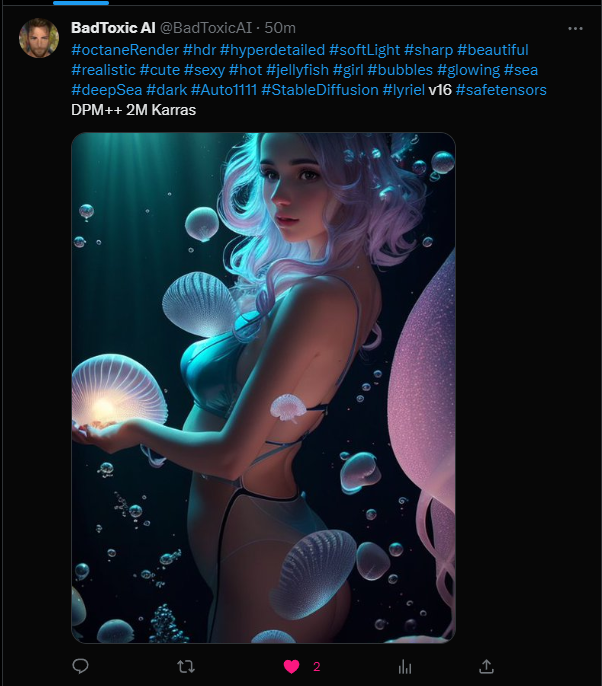

# twitter-image-poster
Post (random) images on Twitter.

Created for posting pictures created with [Auto1111](https://github.com/AUTOMATIC1111) Stable Diffusion AI. 
It will automatically use tags (__/\B(\#[a-zA-Z0-9]+\b)/g__) from the positive prompt that is stored in the png meta data of the generated images as text in the Twitter post.

## Instructions
1. Checkout or download this project.
2. Install [NodeJS](https://nodejs.org/en/download) if not done before.
3. Type __npm install__ in __cmd__ in the root folder of this project to install all needed packages.
4. Set your Twitter API in the __config.js__ (find them on https://developer.twitter.com/en/portal/dashboard, login and create an app __with writing rights__).
5. (Optional) You can add tags to the __defaultTags__ string in the __config.js__ file that will always be used.
6. Put your images in the __images__ folder.
7. npm start

Posted images will be moved to the foler __images-sent__ if exists (must be created if wanted).

## Single post or repeating

Set __repeat__ in the __config.js__ file to __false__ if you only want to do a single post. 
Is __repeat__ set to __true__ it will post repeatedly every __repeatSeconds__ seconds with a variance of __repeatVariation__ seconds. All values can be changed in the __config.js__ file.

## Quote previous tweets

Set __quote__ in the __config.js__ file to __true__ to quote previous tweets in your new tweets. 
You can use these three flags in the __config.js__ file to determine when it should quote or not (when comparing images): 
- __hashWithTags__ Uses the tags in the png meta data (not the __defaultTags__ from the __config.js__).
- __hashWithModel__ Uses the model (checkpoint) used for the image generation, read from the png meta data.
- __hashWithSampler__ Uses the sampler used for the image generation, read from the png meta data.

That means if all three are set to __false__ it will always quote, no matter the used tags, model or sampler.

## Examples

Result of an image that contains the following Meta data:

	octane render \(#octaneRender\), #hdr, (#hyperdetailed:1.15), (soft light\(#softLight\), #sharp:1.2), #beautiful, #realistic, 1 #cute #sexy #hot #jellyfish #girl, #bubbles, #glowing, deep #sea \(#deepSea\), #dark
	Negative prompt: blush,fewer fingers,(low quality, worst quality:1.4), (bad anatomy), (inaccurate limb:1.2),bad composition, inaccurate eyes, extra digit,fewer digits,easynegative,monochrome, zombie,overexposure, watermark,text,bad hand,extra hands,extra fingers,too many fingers,fused fingers,bad arm,distorted arm,extra arms,fused arms,extra legs,missing leg,disembodied leg,extra nipples, detached arm, liquid hand,inverted hand,disembodied limb, oversized head,extra body, extra navel,easynegative,(hair between eyes),sketch, duplicate, ugly, text, logo, worst face, (bad and mutated hands:1.3), (blurry:2.0), geometry, bad_prompt, (bad hands), (missing fingers), multiple limbs, bad anatomy, (interlocked fingers:1.2), Ugly Fingers, (extra digit and hands and fingers and legs and arms:1.4), ((2girl)), (deformed fingers:1.2), (long fingers:1.2),(bad-artist-anime), bad-artist, bad hand, extra legs ,(ng_deepnegative_v1_75t), naked, breasts, nude, nsfw, no clothes
	Steps: 20, Sampler: DPM++ 2M Karras, CFG scale: 7, Seed: 1270640879, Size: 540x960, Model hash: ec6f68ea63, Model: lyriel_v16, Version: v1.3.2

Result of a tweet with quoting a previous tweet that used the same tags, model and sampler:

# Find me

- [BadToxic Discord Server](https://discord.gg/8QMCm2d)
- [Instagram Main](http://instagram.com/xybadtoxic)
- [Instagram AI](http://instagram.com/badtoxicai)
- [Instagram Developer](http://instagram.com/badtoxicdev)
- [Twitter Main](https://twitter.com/BadToxic)
- [Twitter AI](https://twitter.com/BadToxicAI)
- [TikTok](https://www.tiktok.com/@badtoxic)
- [Twitch](https://www.twitch.tv/xybadtoxic)
